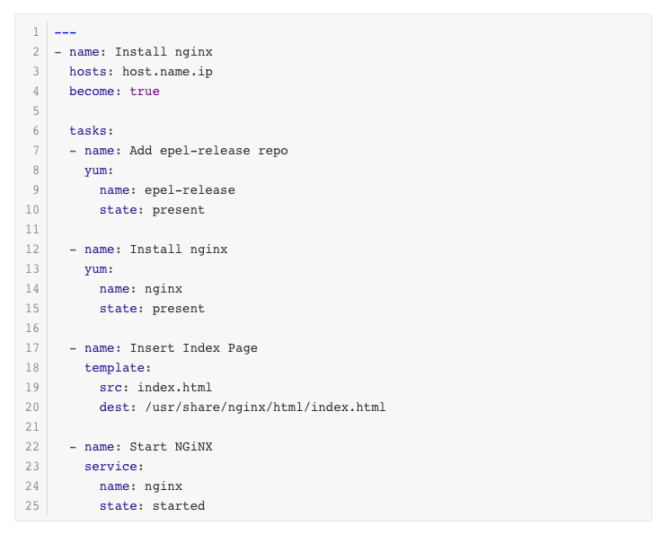
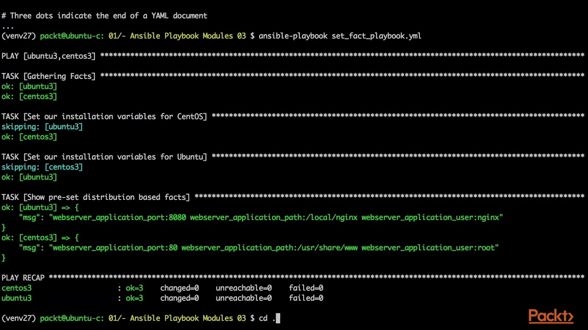

## 목차
- [Ansible 이란](#1)
- [Ansible을 사용해야되는 이유](#2)
- [Ansible의 목표](#3)
- [Ansible의 특징](#4)
- [Ansible 기본 개념](#5)

---

## Ansible 이란 
- Infrastructure as a Code(IaC)를 이용한 **배포 자동화 도구**이면서 **서버 자동화 도구**라고 할수 있다.
- 현재 가장 많이 사용되는 배포/서버 자동화 도구 이다.
- Ansible의 경우 Agent없이 SSH를 이용해서 클라이언트에 접속 및 운영을 할 수 있다.

## Ansible을 사용해야되는 이유 
1. IT관리자가 관리해야 하는 역활의 증가
2. IT관리자가 하나의 서버에 배포환경 구축하고 SW설치하고 운영 및 업데이트까지 공통적인 일들을 반복적으로 수행하기에 시간적으로 비효율적다.
3. 서버 가상화 기술을의 발전으로 다양한 환경(클라우드-퍼블릭/프라이빗/하이브리드)이 도입되면서 IT관리자가 bash or powershell을 통해서 관리하는 것이 힘들어 졌다.
4. 급속도로 변화하는 IT서비스요구에 따라 인프라 역시 기민성(Agility)/유연성(Flexibility)이 필수가 되는 시기가 되었다.

> Ansible은 SF 소설에서 등장하는 공간적 거리에 관계없이 동시에 통신이 가능하도록 하는 기구, 즉 초광속 통신 장치가 본래의 의미입니다.

> 2012년 2월 20일 처음 공개되어 2015년 10월 Red Hat에 의해 인수되었습니다. 

## Ansible의 목표 
- Simple, agentless IT automation that anyone can use
  - 간단하며, Agent가 없이 IT 자동화를 누구나 사용 가능하다.
- 아래 3가지 이유/개념으로 인하여 인프라환경을 호율적으로 관리하며, 코드로 관리 할수 있는 도구가 필요하게 되어 Ansible이 유명해지고, 빠른 보급이 가능해졌다.
  - IaaS(Infrastructure as a Service)
    - 서버나 네트워크에 대한 부분을 구입 또는 렌트 하지 않고 SW적으로 처리하는 것이 가능해지면서 필요한 만큼 할당 받고 반납을 한다.
  - IaC(Infrastructure as a Code)
    - 인프라를 관리하는 과정들을 SW가 자동으로 실행하고 관리할수 있는 코드 형태로 기술한다 는 것을 의미 한다.
  - DevOps
    - 개발 및 운영 단계를 밀접하게 연결하여 SW 라이프 사이클을 가능한 짧게 하기 위한 개념이다.
    - SW의 개발 / 빌드 / 테스트 / 배포 / 운영 의 모든 과정을 코드로 관리하여 효율을 높이는 것을 의미 한다.
- Ansible을 대체 할 수 있는 솔루션들

|     |Puppet|Chef|Salt|Ansible|
|:---:|:---:|:---:|:---:|:---:|
|개발사|Puppet Lab|Opscode|SaltStack|Ansible Works|
|배포시기|2005.08|2009.01|2011.03|2012.03|
|개발언어|Ruby|Ruby(Cilent), Erlang(Server)|Python|Python|
|코드베이스|Puppet Forge|Chef Supermarket|Salt-Formula|Ansible Galaxy|
|Web UI|Puppet Enterprise|Chef Manage|SaltStack Enterprise|Ansible Tower(라이센스), AWX(오픈소스)|
|정의파일|독자 DSL, 내장 Ruby|독자 DSL(Ruby 베이스)|YAML, 독자 DSL(Python 베이스)|YAML|
|Agent 설치 유무|필요|필요|선택가능|불필요|
> 코드베이스는 GitHub이나 DockerHub처럼 다수의 사용자들간에 코드를 공유할수 있는 공간을 말한다.

> 노드 관리를 위해 Agent가 설치되어 있어야 한다면, Agent설치관련 이슈나 관리해야되는 부분이 증가한다.
> YAML 형태로 Playbook이 배포되기 때문에 가독성이 뛰어나다.

## Ansible의 특징 
1. Agent가 없어도 SSH를 통해서 Ansible을 활용할수 있다.
   1. 구성관리가 필요한 대상 서버가 실제 운영 중이라도 SSH를 통해서 정보를 취득 및 구성 변경을 할 수 있다.
   2. Windows들 중에서 WinRM이 지원되는 경우에 사용이 가능하다.
2. 연산을 여러번 적용해도 결과가 달라지지 않는 멱등성을 보장한다.
3. 다양한 모듈이 지원되어 원하는 모든 작업을 진행할 수 있다. 또한 플러그인을 통해서 추가적인 기능도 사용 가능하다.
4. Ansible에서는 높은 보안과 신뢰성을 위한 기능들을 제공합니다. 사용자의 환경에 따라 접속정보들을 변경할 수 있으며, 주요 파일들을 암호화 하여 보호할 수 있습니다.
5. 다른 구성 도구에 비해서 빠르게 학습 및 적용이 가능하다.

---

## Ansible 기본 개념 
- Ansible은 3개의 구성 요소가 있으며, 이 요소들을 조합해서 어디서1 무엇을2 어떻게3 수행할지 정의한다.
  - 인벤토리1
    - Ansible에 의해 제어되며 Infrastructure as a Code의 대상이 될 서버의 목록을 정의하는 파일
    - 기본적으로 '/etc/ansible/hosts'안에 정의하게 되며 정의
    - 인벤토리 내에는 서버의 접속 정보(SSH 접근, 포트, 리눅스 사용자)등 내용을 정의 합니다.
    - 그룹화 기능을 통해서 각 서버의 특징 별로 그룹화 할수 있으며, 특정 그룹만을 대상으로 명령을 내릴수 있다.
  - 플레이북2
    - YMAL(권장)이나 JSON으로 각 서버에서 무엇을 수행할지 정의합니다.
    - Ansible을 사용한다는 것은 플레이북을 사용한다는 의미와 같으며, 블레이북 단독으로 사용하지 않고 인벤토리 파일과 결합하여 사용한다.
    - 인벤토리 파일을 결합 하지 않으려면 플레이북 내에 각서버 접속 정보 등을 기록해야된다.
  - 모듈3
    - 플레입북에서 Task가 어떻게 수행될지 나타내는 요소입니다.
    - 위 플레이북 샘플에서 "yum", "service"가 Ansible의 모듈입니다.
    - 각 OS에 따른 모듈이 따로 있습니다.
      - EX) CentOS -> "yum" / Ubuntu -> "apt"
    - debug 모듈의 msg 라는 옵션으로 필요한 내용을 출력하게 할수 있습니다.
  - Ansible의 플레이북 실행 예제 입니다.

> [How to build your inventory](https://docs.ansible.com/ansible/latest/user_guide/intro_inventory.html#intro-inventory)에서 인벤토리 작성관련 내용을 확인할 수 있습니다.

> [Ansible Module Index](https://docs.ansible.com/ansible/latest/modules/modules_by_category.html#modules-by-category)에서 지원되는 전체 모듈을 확인 할수 있습니다.

> Ansible에서 필요한 모듈이 제공안되는 경우 모듈을 제작 할수 있으며, 모듈제작에 대한 내용은 [Ansible 공식 Documentation](https://docs.ansible.com/ansible/latest/dev_guide/index.html)을 참고하세요.
---

