## 목차
- [사전 설치 패키지](#1)
  - [설치](#1-1)
  - [각 패키지 버전](#1)
- [AWX 설치](#2)
- [AWX 설치 중 발생 오류 들](#3)

> GitHub에서 제공 중인 설치 메뉴얼의 내용 중 Docker를 이용한 설치 부분에 대한 내용을 정리한것이다.

> CentOS 7 Minimal 64bit에서 설치하는 것으로 가정하며, AWX는 Ansible playbook을 이용해서 Docker-compose file을 생성해서 Docker Container로 구동이 된다.

> Docker에 대한 내용은 Docker review 문서( [Github](https://github.com/andrewjin89/Docker_Review) )를 참고 하면 된다.

---

## 사전 설치 패키지

### 설치
1. `yum install epel-release`
2. `yum-config-manager --add-repo https://download.docker.com/linux/centos/docker-ce.repo`
3. `yum install docker-ce docker-ce-cli containerd.io`
4. `rpm -Uvh http://opensource.wandisco.com/centos/7/git/x86_64/wandisco-git-release-7-2.noarch.rpm`
5. `yum --enablerepo=WANdisco-git info git`
6. `yum --enablerepo=WANdisco-git install git git-svn`
7. `yum install gettext ansible nodejs npm gcc-c++ bzip2`
8. `yum install python-devel python-pip`
9. `pip install --upgrade pip`
10. `pip install six==1.14.0`
11. `pip install cffi==1.13.2`
12. `pip install docker>=4.1.0`
13. `pip install docker-compose>=1.25.3`

### 각 패키지 버전
- git : Requires Version 1.8.4+
- ansible : Requires Version 2.8+
- docker : A recent version
- nodejs : 10.X LTS Version or high
- npm : 6.X LTS Version or high

---

## AWX 설치
1. `git clone https://github.com/ansible/awx.git`
2. `cd awx/installer/`
   1. inventory 설정 중 버전 설정이 필요한 경우
      1. `vi inventory`
      2. dockerhub_base 부분에 버전 명시 / 버전 명시 하지않으면 AWX latest 버전으로 설치됨.
   2. inventory 설정 중 proxy 설정이 필요한 경우
      1. `vi inventory`
      2. Proxy
      3. http_proxy= http://proxy:3128
      4. https_proxy= http://proxy:3128
      5. no_proxy= mycorp.org
      6. 위 2번에서 5번 내용까지 수정
3. `ansible-playbook -i inventory install.yml`
4. 설치 성공 하면 아래와 같은 결과가 나타난다.
   - 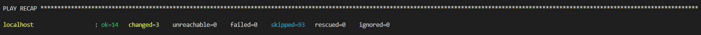
   - 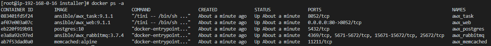
5. 외부 open된 포트인 80포트로 접속해서 웹UI를 확인 한다.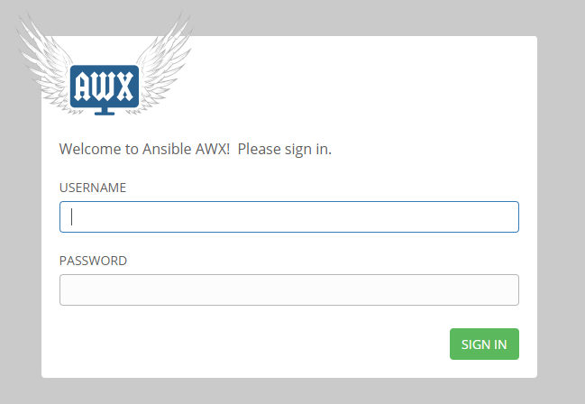
> 접속 시 업데이트를 위한 화면이 보이는 경우 잠시 기다리면 된다.

> 기본 패스워드는 admin/password 이다.

> 상세한 설치 방법 및 관련 정보는 [AWX GIT](https://github.com/ansible/awx/blob/accf000bdf5acdec46080e71f6d5650e62188764/INSTALL.md#installing-awx)을 참고 하면 된다.

---

## AWX 설치 중 발생하는 오류

1. Ansible Version이 2.8 이하 인 경우 아래 이미지와 같은 에러가 발생한다.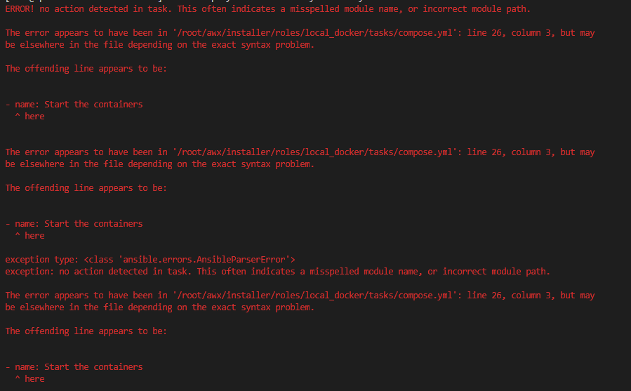
   - 해결방법 Ansible의 버전을 2.8 이상으로 업그레이드 한다.
     - 2020년 1월 28일 기준 ansible 2.9.2버전을 yum으로 설치할수 있다.
2. docker가 미구동 또는 미설치 중인 상태로 설치 및 구동 하면 된다.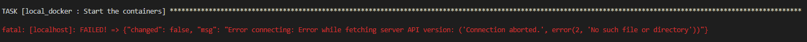
   - 설치 방법
     - `yum install docker docker-compose`
   - 구동 방법
     - `systemctl start docker`
     - `systemctl enable docker`
3. python의 docker-compose 모듈이 없어서 발생한 에러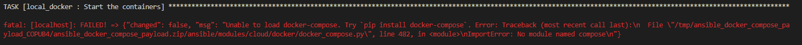
   - 모듈 설치 법
     - `pip install docker-compose`
     - 모듈 설치중 에러 발생 시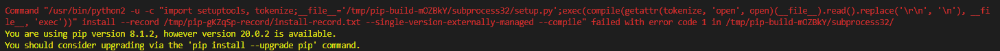
       - `pip install --upgrade pip`
       - 모듈 설치중 에러 발생 시!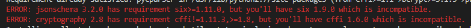
         - `pip install six==1.14.0`
         - `pip install cffi==1.13.2`
     - 모듈 설치중 에러 발생 시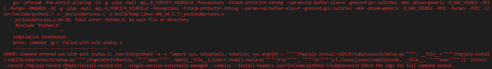
       - `yum install python-devel`
4. python의 docker 모듈 충돌시 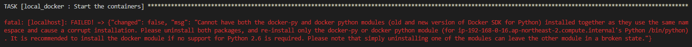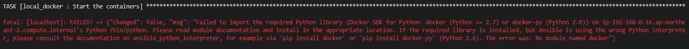
   1. `yum remove python-docker-py-1.10.6-9.el7_6.noarch`
   2. `pip uninstall docker`
   3. `pip uninstall docker-py`
   - 위 3가지 패키지 삭제 후 재설치 한다. 단, python 버전에 따라 pip 모듈을 선택해야한다.
   1. `yum install python-docker-py`
   2. python이 2.7 이상 일때
     - `pip install docker`
   3. python이 2.6 일때
     - `pip install docker-py`
---