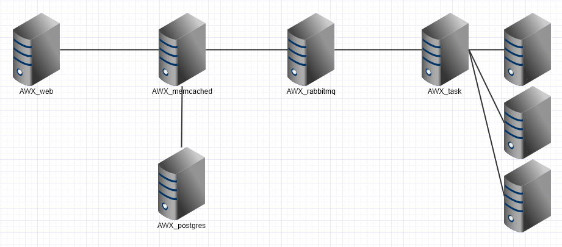

## 목차
- [AWX 서버 구성](#1)
- [AWX/Ansible 구성 이슈](#2)
- [AWX 한글화](#3)
- [AWX 메뉴 구성](#4)

---

## AWX 서버(컨테이너) 구성
|     name      |                                   role                                     |
| :-----------: | :------------------------------------------------------------------------: |
|   AWX_task    |                  AWX에서 template(playbook)을 실행하는 역활                  |
|    AWX_web    |  일반사용자 및 관리자가 접근하는 웹페이지 / 대부분의 설정 및 작업을 여기서 설정  |
| AWX_memcached |                    등록된 인스턴스들에 대한 로컬캐시 역활                     |
| AWX_rabbitmq  |     AWX_task에서 실행된 template을 각 서버에 전달하고 결과를 받아오는 역활     |
| AWX_postgres  |                              AWX의 데이터베이스                             |

---

## AWX/Ansible 구성 이슈
1. Ansible 2.4 이상 버전에서 python의 버전 차이로 인해 Ansible 2.3버전의 playbook에서 SyntaxError가 발생할수 있다.
   1. python버전을 2.6 이상으로 업데이트 하면 해결 가능하다.
      - `yum install python26 --enableerepo=epel`
      - 다른 어플이케이션과 의존성 문제 발생 시 python2.6을 소스컴파일 하고 Ansible의 인벤토리 작성 시 ansible_python_interpreter 옵션을 통해서 python 경로를 명시적으로 지정한다.
        - `centos-hostname ansible_python_interpreter=/usr/bin/python26`
2. HP-UX에서 Python error on os.uname() function으로 에러가 발생 할 수 있다.
   1. 에러 샘플
      - `> python -c "import os; print os.uname()" Traceback (most recent call last): File "", line 1, in OSError: [Errno 72] Value too large to be stored in data type`
        - Python의 os.uname 함수에서 호스트명을 가져오는 도중 해당 호스트명이 길어서 OS의 data type과 맞지 않아 발생하는 문제로 생각된다.
   2. hp.com 포럼에서 kernel parameter를 확인 후 uname_overflow의 설정 값이 0이면 1로 변경하면 해결된다.
      - 변경 후에 해결 되지 않으면, `gater_facts: no`로 설정하면 된다.

---

## AWX 한글화
1. github awx에서 영어로 된 원본 소스를 한글로 번역해서 빌드 해야된다.
   - 시도중.....
---

## AWX 메뉴 구성
|        메뉴         |                       내용                       |
| :---------------: | :--------------------------------------------: |
|     DASHBOARD     |          Job의 최근 실행 상태를 한눈에 볼 수 있는 화면          |
|       JOBS        |                 최근 실행한 JOB 리스트                 |
|     SCHEDULES     |                스케줄로 등록된 Job 리스트                |
|    PORTAL MODE    |       등록된 Job과 실행중인 Job을 하나의 화면에서 확인 가능        |
|     PROJECTS      |          playbook 모음을 하나의 단위로 묶어서 관리           |
|    CREDENTIALS    |            ansible 실행을 위한 계정 관리 메뉴             |
| CREDENTIAL TYPES  |                  사용자 설정 인증 타입                  |
|    INVENTORIES    |               Job을 실행하는 Host 모음                |
|     TEMPLATES     |  Inventory와 Playbook을 조합하여 실제 job이 실행되는 구성 단뒤  |
|   ORGANIZATIONS   | Users, Teams, Projects, Inventoryes의 최상위 묶음 단위 |
|       USERS       |                 AWX 사용자 관리 메뉴                  |
|       TEAMS       |                 AWX 사용자 그룹 단위                  |
| INVENTORY SCRIPTS |           사용자 Inventory Script 관리 메뉴           |
|   NOTIFICATIONS   |         ansible의 실행 상태를 알려주는 알람 등록 화면          |
|  MANAGEMENT JOBS  |               Job 리스트나 실행 상태를 관리               |
|  INSTANCE GROUPS  |                Job을 실행하는 단위 그룹                 |
|     SETTINGS      |        AWX의 인증과 기본 Job, ansible 설정을 관리         |
> 자세한 내용은 [Ansible Tower 가이드 문서](http://docs.ansible.com/ansible-tower/)를 참고하면 된다.

---