## 목차
- [AWX 메뉴 구성](#1)
  - [AWX 화면 구성(View)](#1-1)
- [Credentials 등록](#2)
  - [GitLab 연동](#2-1)
  - [Machine](#2-2)
- [Project 등록](#3)
- [Inventory 등록](#4)
  - [Host 등록](#4-1)
  - [Smart Inventory 등록](#4-2)
  - [Inventory Script 등록](#4-3)
- [Job Template 등록](#5)
  - [Job Template 등록](#5-1)
  - [Workflow Template 등록](#5-2)
- [Organizations 등록](#6)
- [User 등록](#7)
- [Teams 등록](#8)
- [Notifications 등록](#9)
- [Instance Groups 등록](#10)
---

## AWX 메뉴 구성
|메뉴|내용|
|:-:|:-:|
|DASHBOARD|Job의 최근 실행 상태를 한눈에 볼 수 있는 화면|
|JOBS|최근 실행한 JOB 리스트|
|SCHEDULES|스케줄로 등록된 Job 리스트|
|PORTAL MODE|등록된 Job과 실행중인 Job을 하나의 화면에서 확인 가능|
|PROJECTS|playbook 모음을 하나의 단위로 묶어서 관리|
|CREDENTIALS|ansible 실행을 위한 계정 관리 메뉴 |
|CREDENTIAL TYPES|사용자 설정 인증 타입|
|INVENTORIES|Job을 실행하는 Host 모음|
|TEMPLATES|Inventory와 Playbook을 조합하여 실제 job이 실행되는 구성 단뒤 |
|ORGANIZATIONS|Users, Teams, Projects, Inventoryes의 최상위 묶음 단위|
|USERS|AWX 사용자 관리 메뉴|
|TEAMS|AWX 사용자 그룹 단위 |
|INVENTORY SCRIPTS|사용자 Inventory Script 관리 메뉴|
|NOTIFICATIONS|ansible의 실행 상태를 알려주는 알람 등록 화면|
|MANAGEMENT JOBS|Job 리스트나 실행 상태를 관리|
|INSTANCE GROUPS|Job을 실행하는 단위 그룹|
|SETTINGS|AWX의 인증과 기본 Job, ansible 설정을 관리|
> 자세한 내용은 [Ansible Tower 가이드 문서](http://docs.ansible.com/ansible-tower/)를 참고하면 된다.
---

## AWX 화면 구성(View)
- DASHBOARD 화면 예시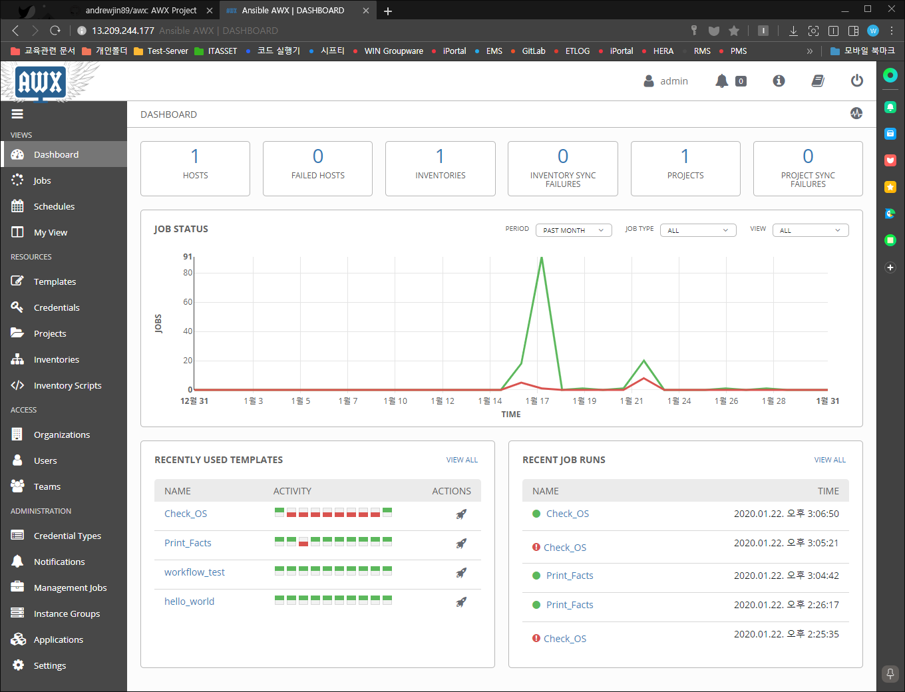
  - 등록된 호스트 갯수
  - 등록된 인벤토리 갯수
  - 등록된 프로젝트 갯수
  - 연결 실패한 호스트 갯수
  - 동기화 실패한 인벤토리 갯수
  - 동기화 실패한 프로젝트 갯수
  - 등록된 Job 실행 성공(초록색) 및 실패(빨간색) 그래프
  - 최근 사용된 템플릿 현황
  - 최근 수행된 Job 리스트
- JOBS 화면 예시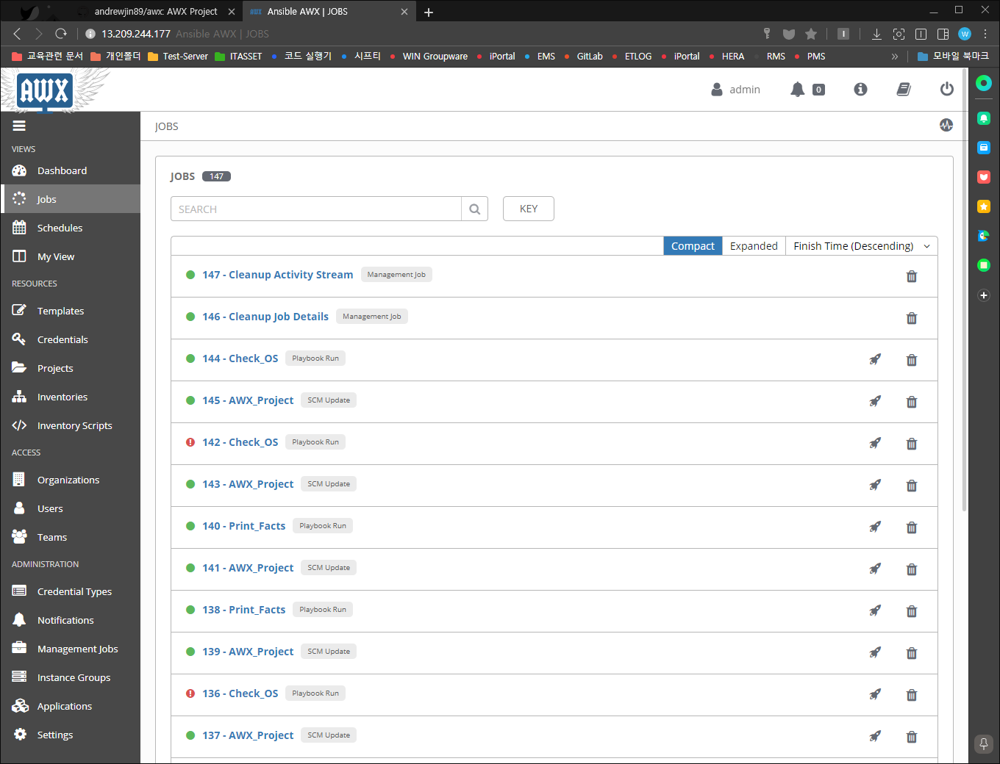
  - 전체 수행된 Job 리스트
    - 각 Job 클릭시 상세정보 표시
      - Job의 상세 정보
      - 성공 실패 등 상태 정보
      - 수행로그 정보
- SCHEDULES 화면 예시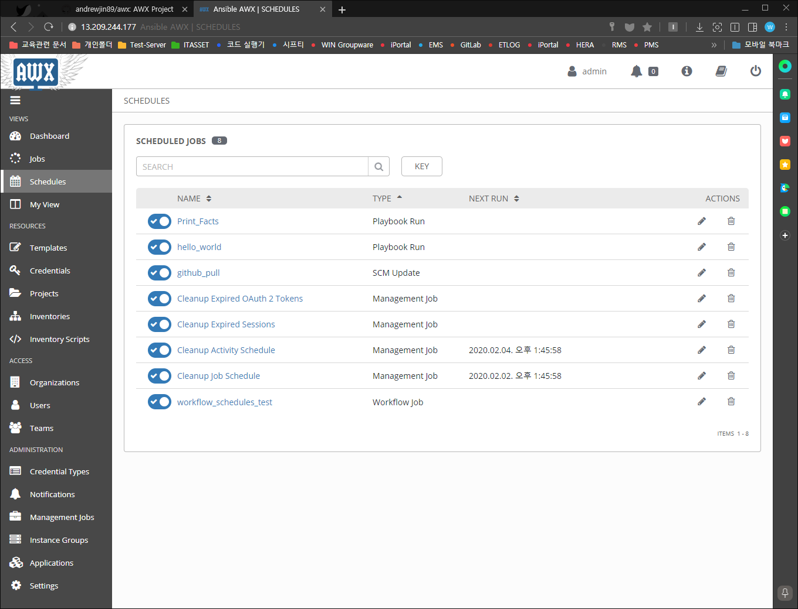
  - 등록된 Job리스트
  - 스케줄 설정 정보 
  - 다음 실행 시간 표시
---

## Credentials 등록
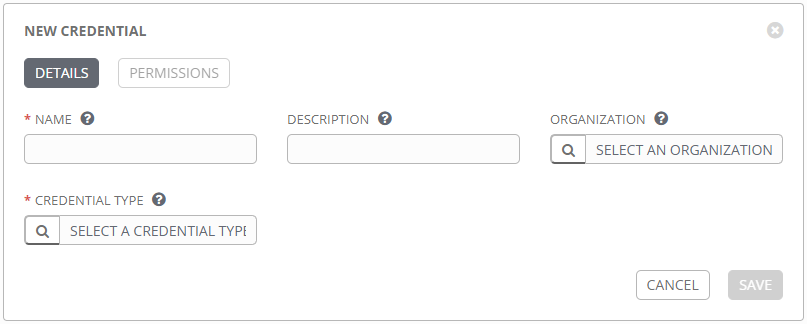
- DETAILS
  - NAME**(필수)** : 등록할 인증정보에 대한 이름
  - CREDENTIAL TYPE**(필수)** : 등록할 인증 정보 종류
  - DESCRIPTION : 인정정보에 대한 설명
  - ORGANIZATION : 인증정보를 사용할 조직
- PERMISSIONS => 새로 만들 경우 저장 후 활성화 됨.
  - 인증정보를 사용할 계정이나 그룹을 지정한다.

---

### Git 연동 예시 
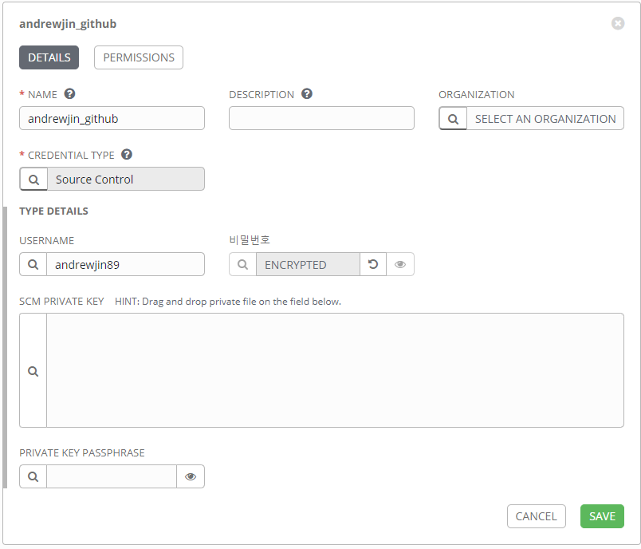
> GITHUB / GITLAB 등 Source Control에 대한 접근 설정
- TYPE DETAILS
  - USERNAME : git login ID
  - PASSWORD : git login Password
  - SCM PRIVATE KEY : git login을 위한 private 키값 / Drag and Drop으로 입력한다.
  - PRIVATE KEY PASSPHRASE : private 키에 대한 비밀번호
---

### Machine 
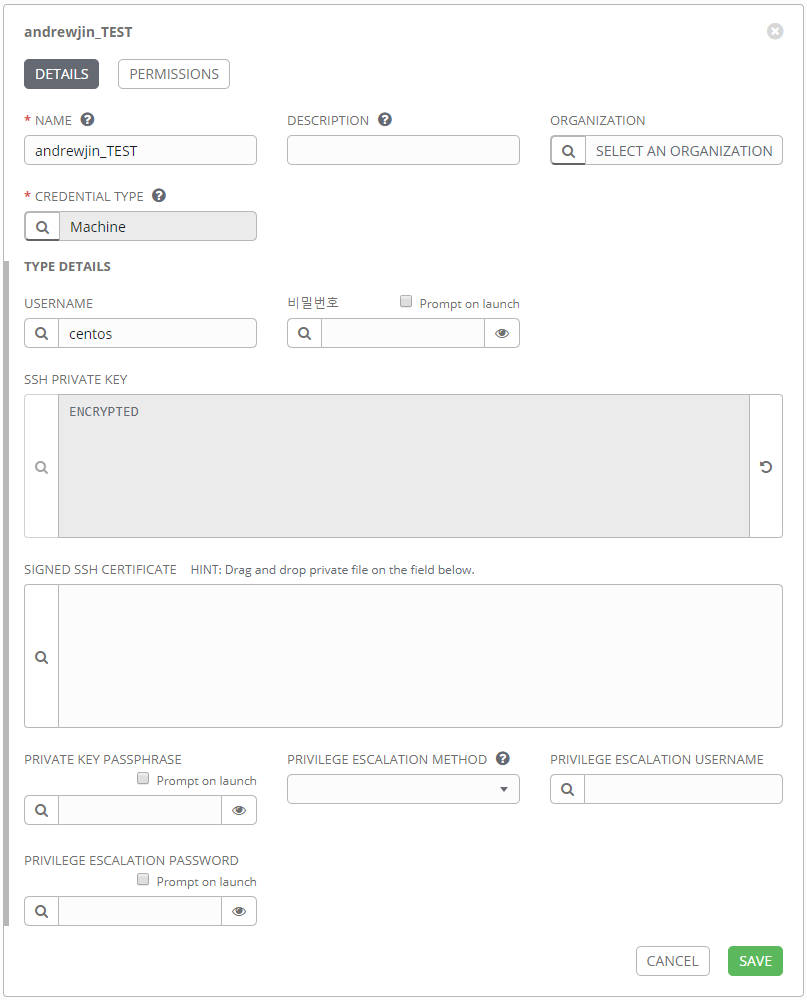
> 서버 접근을 위한 설정
- TYPE DETAILS
  - USERNAME : git login ID
  - PASSWORD : git login Password
  - SSH PRIVATE KEY : ssh 개인키
  - SIGNED SSH CERTIFICATE : 서명된 ssh키 인증서
  - PRIVATE KEY PASSPHRASE :  ssh 개인키 비밀번호
  - PRIVILEGE ESCALATION METHOD : 권한 상승용 명령어
  - PRIVILEGE ESCALATION USERNAME : 권한 상승용 ID
  - PRIVILEGE ESCALATION PASSWORD : 권한 상승용 Password
- 실제 작성하는 값 예시

|항목|설정값|
|:--:|:--:|
|name|Ansible Control Node Credential|
|description|playbook 을 실행하기 위해서 control node 에 접속하기 위한 credential|
|organization|Default|
|type|machine|
|username|ssh 계정명|
|password|ssh 패스워드|
|PRIVILEGE ESCALATION|sudo|

---

## Project 등록
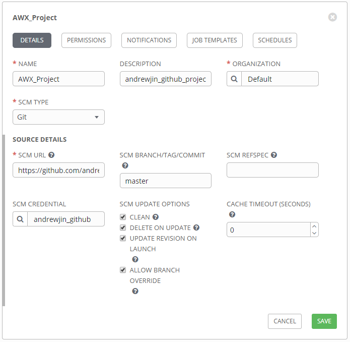
> playbook을 관리하는 playbook 그룹
- DETAILS
  - NAME**(필수)** : 프로젝트 이름
  - DESCRIPTION : 프로젝트 설명
  - ORGANIZATION**(필수)** : 이 프로젝트를 사용할 조직
  - SCM TYPE**(필수)** : playbook을 관리할 방법
    - SCM URL
    - SCM BRANCH/TAG/COMMIT
    - SCM REFSPEC
    - SCM CREDENTIAL
    - SCM UPDATE OPTIONS
      - CLEAN
      - DELETE ON UPDATE
      - UPDATE REVISION ON LAUNCH
      - ALLOW BRANCH OVERRIDE
    - CACHE TIMEOUT
- 실제 작성하는 값 예시

|항목|설정값|
|:--:|:--:|
|name|Project Name|
|description|프로젝트 설명|
|organization	Default|
|SCM type|git|
|SCM Url|ansible playbook github repo 주소|
|SCM Branch|master|
|SCM Update Options|Clean, Update on Launch 체크|
---

## Inventory 등록
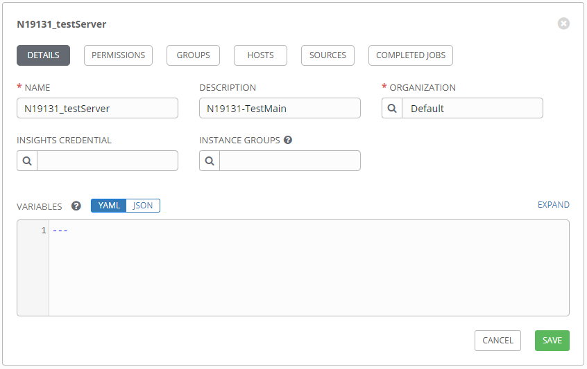
> ansible CLI에서는 hosts파일을 지정하거나 직접 작성한 Inventory파일을 지정하면 되지만, AWX에서는 target node를 db(postgresql)로 관리한다.
> 따라서 아래 방법을 이용해서 관리해야한다.
> 1. SCM에서 hosts파일을 읽어오거나 (매번 playbook 이 실행되기 전에 hosts 내역을 업데이트 한다)
> 2. dynamic inventory(클라우드와 같이 target node 들이 유연하게 생성/삭제되어 변경되는 경우)
> 3. 수동으로 직접 관리한다.(수동으로 각각의 서버를 등록/삭제/수정)

- DETAILS
  - NAME**(필수)** : 서버 인벤토리 이름
  - DESCRIPTION : 서버 인벤토리 설명
  - ORGANIZATION**(필수)** : 서버  인벤토리를 사용할 수 있는 조직
  - INSIGHTS CREDENTIAL
  - INSTANCE GROUPS
  - VARUAVLES : 이 그룹에서 playbook 실행 시 사용할 playbook변수 리스트
- PERMISSIONS : 이 서버 인벤토리를 사용할 수 있는 사용자 및 사용자 그룹
- GROUPS : 이 서버 인벤토리에 포함될 서버 그룹
- HOSTS : 이 서버 인벤토리에 포함될 서버
- SOURCES
- COMPLETED JOBS : 이 인벤토리에서 실행 된 job(playbook) 리스트
---

### Host 등록 
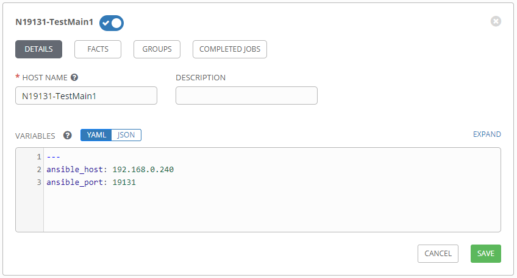
---

### Smart Inventory 등록 

---

### Inventory Script 등록 
---

## Job Template 등록
---

### Job Template 등록 
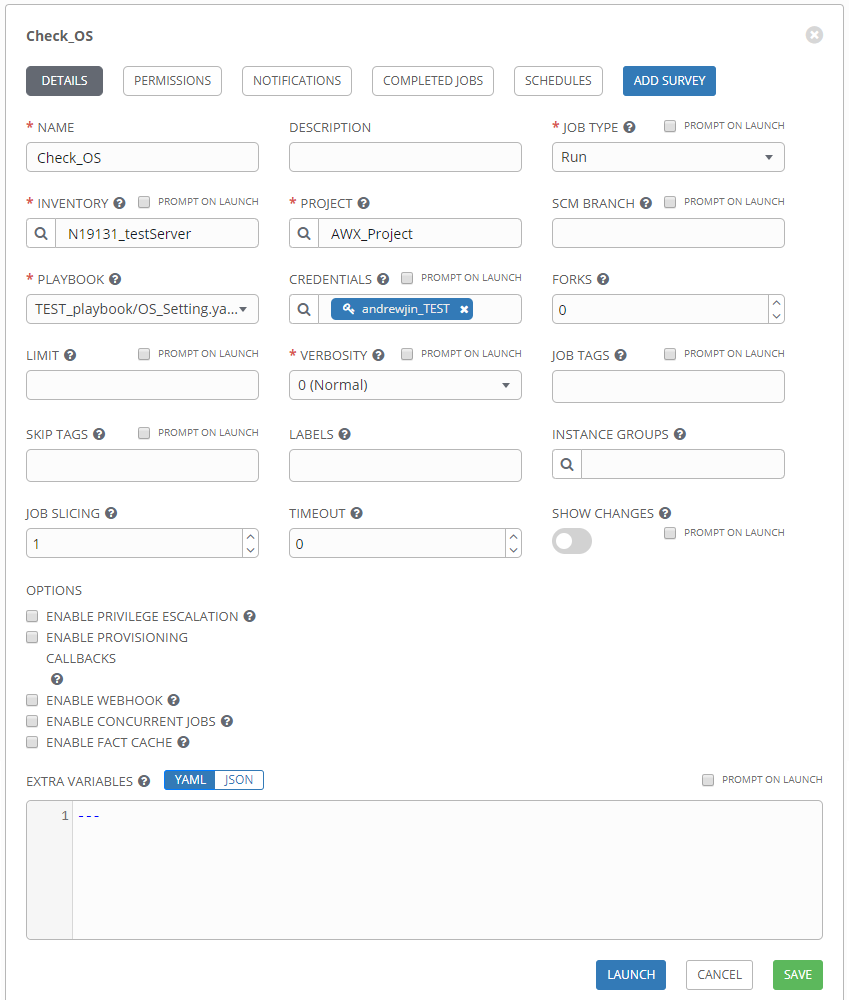
---

### Workflow Template 등록 
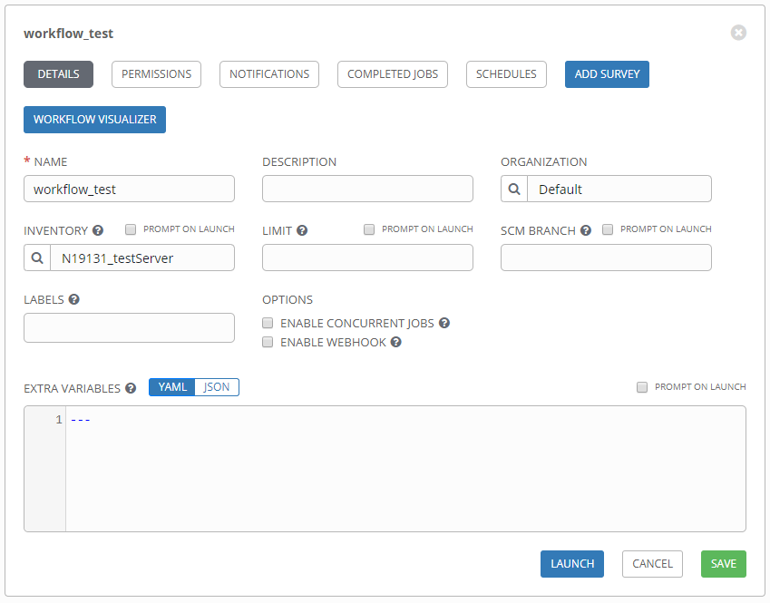
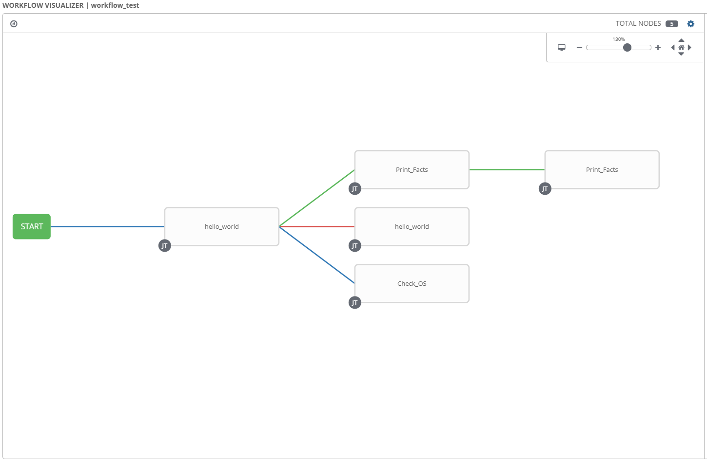
- 첫번째 JOB(hello_world) 실행 후 아래 세가지 중 두가지 실행(초록/파랑 또는 빨간/파랑) 후 세번째 JOB(Print_Facts) 실행
  * 성공 시(초록색라인) 두번째 JOB(Print_Facts) 실행
  * 실패 시(빨간색라인) 두번째 JOB(hello_world) 실행
  * 실행 후(파란색라인) 두번째 JOB(Check_OS) 실행
---

## Organizations 등록
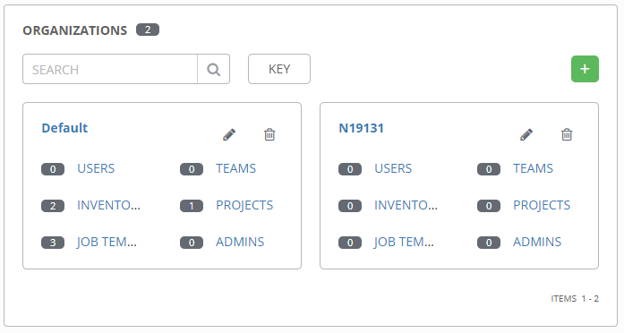
> 사용자 조직으로 각 그룹에 유저 그룹(teams)따로 설정 할수 있다.
---

## User 등록
---

## Teams 등록
---

## Notifications 등록
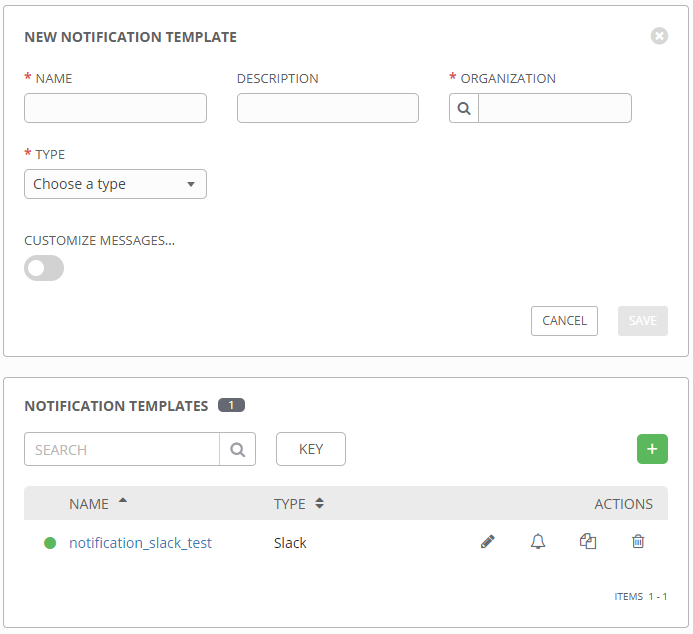
---

## Instance Groups 등록